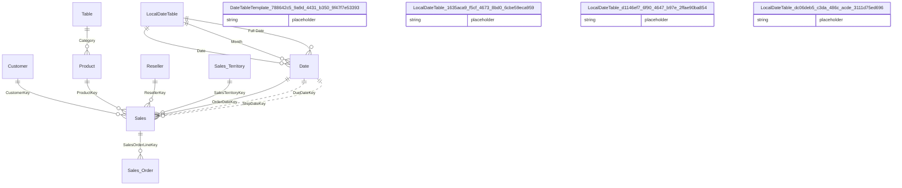

# Relationships

> Total Relationships: 12

## Entity Relationship Diagram

## Relationship Details

| From Table | From Column | To Table | To Column | Active | Cross Filter |
|------------|-------------|----------|-----------|--------|--------------|
| Date | Date | LocalDateTable |  | ✓ | Single |
| Date | Month | LocalDateTable |  | ✓ | Single |
| Date | Full Date | LocalDateTable |  | ✓ | Single |
| Sales | CustomerKey | Customer | CustomerKey | ✓ | Single |
| Sales | ProductKey | Product | ProductKey | ✓ | Single |
| Sales | ResellerKey | Reseller | ResellerKey | ✓ | Single |
| Sales Order | SalesOrderLineKey | Sales | SalesOrderLineKey | ✓ | Both |
| Sales | SalesTerritoryKey | Sales Territory | SalesTerritoryKey | ✓ | Single |
| Sales | OrderDateKey | Date | DateKey | ✓ | Single |
| Sales | DueDateKey | Date | DateKey | ✗ | Single |
| Sales | ShipDateKey | Date | DateKey | ✗ | Single |
| Product | Category | Table | Category | ✓ | Single |

---

[← Back to Home](Home.md)
