# Relationships

> Total Relationships: 17

## Entity Relationship Diagram

```mermaid
erDiagram
    Owners ||--o{ Accounts : "Account Owner"
    Accounts ||--o{ Opportunities : "AccountSeq"
    Accounts ||--o{ Cases : "AccountSeq"
    Accounts ||--o{ Contacts : "AccountSeq"
    Industries ||--o{ Accounts : "IndustrySeq"
    Products ||--o{ Opportunities : "ProductSeq"
    Products ||--o{ Cases : "ProductSeq"
    Owners ||..o{ Opportunities : "SystemUserSeq"
    Owners ||..o{ Cases : "SystemUserSeq"
    LocalDateTable ||--o{ Opportunities : "CloseDate"
    Campaigns ||--o{ Opportunities : "CampaignSeq"
    LocalDateTable ||--o{ Cases : "Case Created On"
    LocalDateTable ||--o{ Opportunities : "Opportunity Created On"
    LocalDateTable ||--o{ Opportunity_Calendar : ""
    LocalDateTable ||--o{ Opportunity_Calendar : ""
    LocalDateTable ||--o{ Opportunity_Calendar : ""
    LocalDateTable ||--o{ Opportunity_Calendar : ""
    DateTableTemplate_0039983e_de71_45fb_bd88_812f61c0ff38 {
        string placeholder
    }
    LocalDateTable_16a9f7af_fed3_4e54_9b5a_15d1cdfee444 {
        string placeholder
    }
    LocalDateTable_36e7cc16_9aa7_44be_8b25_7a2fa51c55d8 {
        string placeholder
    }
    LocalDateTable_9e0bbdfc_9803_41d0_b204_481ce398f228 {
        string placeholder
    }
    LocalDateTable_b0573d09_ef3e_45e2_9f39_8a331c91c6c3 {
        string placeholder
    }
    LocalDateTable_de73616c_e116_4a69_92e1_907ce2a4d5db {
        string placeholder
    }
    Territories {
        string placeholder
    }
```

## Relationship Details

| From Table | From Column | To Table | To Column | Active | Cross Filter |
|------------|-------------|----------|-----------|--------|--------------|
| Accounts | Account Owner | Owners | Sales owner | ✓ | Single |
| Opportunities | AccountSeq | Accounts | AccountSeq | ✓ | Single |
| Cases | AccountSeq | Accounts | AccountSeq | ✓ | Single |
| Contacts | AccountSeq | Accounts | AccountSeq | ✓ | Single |
| Accounts | IndustrySeq | Industries | IndustrySeq | ✓ | Single |
| Opportunities | ProductSeq | Products | ProductSeq | ✓ | Single |
| Cases | ProductSeq | Products | ProductSeq | ✓ | Single |
| Opportunities | SystemUserSeq | Owners | SystemUserSeq | ✗ | Single |
| Cases | SystemUserSeq | Owners | SystemUserSeq | ✗ | Single |
| Opportunities | CloseDate | LocalDateTable |  | ✓ | Single |
| Opportunities | CampaignSeq | Campaigns | CampaignSeq | ✓ | Single |
| Cases | Case Created On | LocalDateTable |  | ✓ | Single |
| Opportunities | Opportunity Created On | LocalDateTable |  | ✓ | Single |
| Opportunity Calendar |  | LocalDateTable |  | ✓ | Single |
| Opportunity Calendar |  | LocalDateTable |  | ✓ | Single |
| Opportunity Calendar |  | LocalDateTable |  | ✓ | Single |
| Opportunity Calendar |  | LocalDateTable |  | ✓ | Single |

---

[← Back to Home](Home.md)
