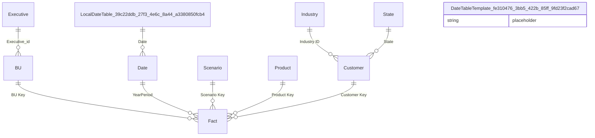

# Relationships

> Total Relationships: 9

## Entity Relationship Diagram

## Relationship Details

| From Table | From Column | To Table | To Column | Active | Cross Filter |
|------------|-------------|----------|-----------|--------|--------------|
| Fact | BU Key | BU | BU Key | ✓ | OneDirection |
| Fact | YearPeriod | Date | YearPeriod | ✓ | OneDirection |
| Fact | Scenario Key | Scenario | Scenario Key | ✓ | OneDirection |
| Fact | Product Key | Product | Product Key | ✓ | OneDirection |
| Fact | Customer Key | Customer | Customer | ✓ | OneDirection |
| BU | Executive_id | Executive | ID | ✓ | OneDirection |
| Customer | Industry ID | Industry | ID | ✓ | OneDirection |
| Customer | State | State | StateCode | ✓ | OneDirection |
| Date | Date | LocalDateTable_39c22ddb-27f3-4e6c-8a44-a3380850fcb4 | Date | ✓ | OneDirection |

---

[← Back to Home](Home.md)
