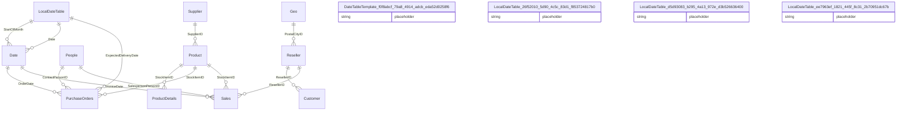

# Relationships

> Total Relationships: 14

## Entity Relationship Diagram

## Relationship Details

| From Table | From Column | To Table | To Column | Active | Cross Filter |
|------------|-------------|----------|-----------|--------|--------------|
| Sales | StockItemID | Product | StockItemID | ✓ | Single |
| Sales | SalespersonPersonID | People | PersonID | ✓ | Single |
| Product | SupplierID | Supplier | SupplierID | ✓ | Both |
| Reseller | PostalCityID | Geo | CityID | ✓ | Both |
| PurchaseOrders | StockItemID | Product | StockItemID | ✓ | Single |
| PurchaseOrders | ContactPersonID | People | PersonID | ✓ | Single |
| ProductDetails | StockItemID | Product | StockItemID | ✓ | Both |
| Sales | ResellerID | Reseller | ResellerID | ✓ | Single |
| PurchaseOrders | ExpectedDeliveryDate | LocalDateTable |  | ✓ | Single |
| Customer | ResellerID | Reseller | ResellerID | ✓ | Single |
| Date | Date | LocalDateTable |  | ✓ | Single |
| Date | StartOfMonth | LocalDateTable |  | ✓ | Single |
| Sales | InvoiceDate | Date | Date | ✓ | Single |
| PurchaseOrders | OrderDate | Date | Date | ✓ | Single |

---

[← Back to Home](Home.md)
