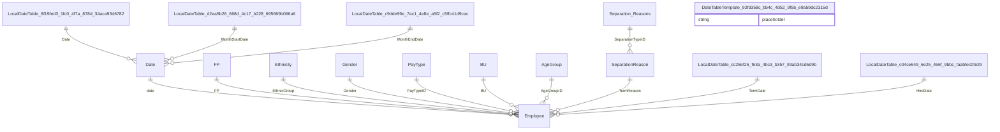

# Relationships

> Total Relationships: 14

## Entity Relationship Diagram

## Relationship Details

| From Table | From Column | To Table | To Column | Active | Cross Filter |
|------------|-------------|----------|-----------|--------|--------------|
| Employee | date | Date | Date | ✓ | OneDirection |
| Employee | FP | FP | FP | ✓ | OneDirection |
| Employee | EthnicGroup | Ethnicity | Ethnic Group | ✓ | OneDirection |
| Employee | Gender | Gender | ID | ✓ | OneDirection |
| Employee | PayTypeID | PayType | PayTypeID | ✓ | OneDirection |
| Employee | BU | BU | BU | ✓ | OneDirection |
| Employee | AgeGroupID | AgeGroup | AgeGroupID | ✓ | OneDirection |
| Employee | TermReason | SeparationReason | SeparationTypeID | ✓ | OneDirection |
| Date | Date | LocalDateTable_6f19fed3-1fc0-4f7a-878d-34aca93d6782 | Date | ✓ | OneDirection |
| Date | MonthStartDate | LocalDateTable_d2ea5b26-668d-4c17-b228-695669b066a6 | Date | ✓ | OneDirection |
| Date | MonthEndDate | LocalDateTable_c9dde99e-7ac1-4e8e-a5f2-c5ffc41d9cac | Date | ✓ | OneDirection |
| Employee | TermDate | LocalDateTable_cc28ef26-f63a-4bc3-b357-93ab34cd6d9b | Date | ✓ | OneDirection |
| Employee | HireDate | LocalDateTable_c04ce649-6e25-466f-9bbc-faabfec0fe29 | Date | ✓ | OneDirection |
| SeparationReason | SeparationTypeID | Separation Reasons | SeparationTypeID | ✓ | BothDirections |

---

[← Back to Home](Home.md)
